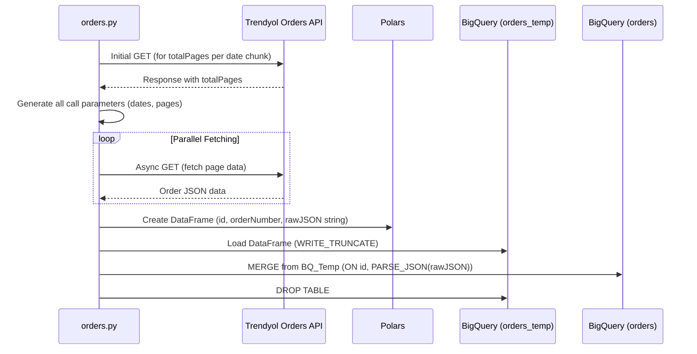
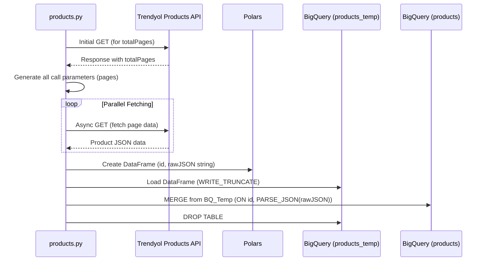
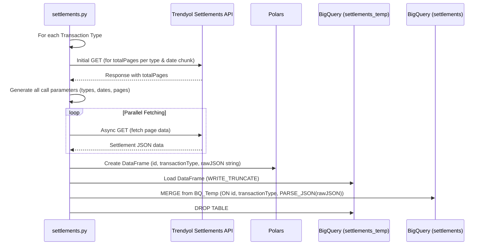
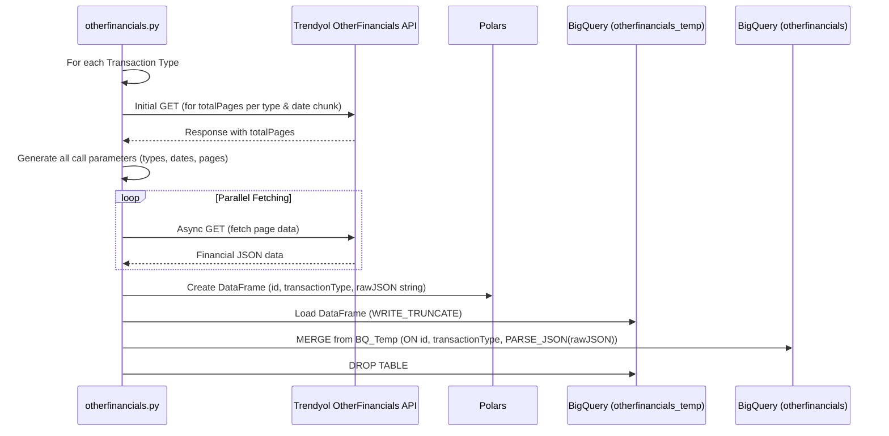

# Detailed Script Documentation for Trendyol-ELT

This document provides a detailed explanation of each Python script within the Trendyol-ELT project. For a general overview, setup, and usage instructions, please refer to the [README.md](README.md).

## Common Concepts

Before diving into individual scripts, here are some common concepts applied across them:

*   **Environment Variables:** All scripts rely on environment variables defined in an `.env` file for API credentials, GCP project information, and BigQuery dataset/table configurations. See `README.md` for setup.
*   **Asynchronous Fetching:** Scripts use `aiohttp` for making asynchronous API calls to Trendyol, improving data retrieval speed.
*   **Rate Limiting:** A delay (`REQUESTS_PER_SECOND`) is implemented between API calls to adhere to Trendyol's rate limits.
*   **Date Chunking:** For endpoints that support date filtering, data is fetched in chunks (e.g., 15 days at a time) to handle large datasets and improve reliability.
*   **Polars DataFrame:** Raw JSON data from the API is initially processed into a Polars DataFrame.
*   **BigQuery Loading:**
    1.  Data is first loaded into a temporary table in BigQuery (e.g., `orders_temp`) with a `WRITE_TRUNCATE` disposition. The `rawJSON` is stored as a STRING.
    2.  A `MERGE` SQL statement is executed to upsert data from the temporary table into the main table (e.g., `orders`). During this merge, the `rawJSON` STRING is parsed into a BigQuery `JSON` data type.
    3.  The temporary table is dropped after a successful merge.

---

## 1. `orders.py`

Fetches order data from the Trendyol API and loads it into the `orders` table in BigQuery.

*   **API Endpoint:** `https://apigw.trendyol.com/integration/order/sellers/{TRENDYOL_SUPPLIER_ID}/orders`
*   **Key Operations:**
    *   **Parameter Generation (`generate_api_call_params`):**
        *   Calculates date ranges based on `N_DAYS_TO_FETCH` and `MAX_DAYS_PER_CHUNK`.
        *   Makes initial sequential calls for each date chunk to determine `totalPages` for pagination.
        *   Generates a list of all parameter sets (including `startDate`, `endDate`, `page`) needed for fetching.
    *   **Asynchronous Data Fetching (`fetch_all_orders_parallel`, `fetch_single_page_async`):**
        *   Uses `aiohttp` and `asyncio` to fetch multiple pages concurrently.
        *   A semaphore limits concurrency to avoid overwhelming the API or local resources.
    *   **Data Preparation:**
        *   Converts the list of fetched order JSON objects into a Polars DataFrame.
        *   Ensures `id`, `orderNumber`, and `rawJSON` (as a string dump of the order JSON) columns are present.
    *   **BigQuery Loading (`merge_and_drop_temp_table`):**
        *   Loads data to `orders_temp`.
        *   Merges into `orders` on `id`. `rawJSON` is parsed from STRING to JSON.
*   **Key Environment Variables Used:**
    *   `TRENDYOL_API_TOKEN`
    *   `TRENDYOL_SUPPLIER_ID`
    *   `GOOGLE_APPLICATION_CREDENTIALS`
    *   `GCP_PROJECT_ID`
    *   `BIGQUERY_DATASET_ID`
    *   `BIGQUERY_LOCATION`
    *   `BIGQUERY_TEMP_TABLE_ID` (defaults to "orders_temp" in script)
    *   `BIGQUERY_ORDERS_TABLE_ID` (defaults to "orders" in script)
    *   `N_DAYS_TO_FETCH`
    *   `MAX_DAYS_PER_CHUNK`
*   **BigQuery Main Table (`orders`):**
    *   `id`: STRING (Order ID, primary key for merge)
    *   `orderNumber`: STRING
    *   `rawJSON`: JSON (Contains the full order details)

### `orders.py` Data Flow

---

## 2. `products.py`

Fetches product data from the Trendyol API and loads it into the `products` table in BigQuery.

*   **API Endpoint:** `https://apigw.trendyol.com/integration/product/sellers/{TRENDYOL_SUPPLIER_ID}/products`
*   **Key Operations:**
    *   **Parameter Generation (`generate_api_call_params_products`):**
        *   Simpler than orders; only paginates.
        *   Makes an initial sequential call to determine `totalPages`.
        *   Generates a list of parameter sets (including `page`) for fetching.
    *   **Asynchronous Data Fetching (`fetch_all_products_parallel`, `fetch_single_page_async_products`):**
        *   Fetches multiple product pages concurrently.
    *   **Data Preparation:**
        *   Converts fetched product JSON objects into a Polars DataFrame.
        *   Ensures `id` and `rawJSON` (as a string dump of the product JSON) columns are present.
    *   **BigQuery Loading (`merge_and_drop_products_temp_table`):**
        *   Loads data to `products_temp`.
        *   Merges into `products` on `id`. `rawJSON` is parsed from STRING to JSON.
*   **Key Environment Variables Used:**
    *   `TRENDYOL_API_TOKEN`
    *   `TRENDYOL_SUPPLIER_ID`
    *   `GOOGLE_APPLICATION_CREDENTIALS`
    *   `GCP_PROJECT_ID`
    *   `BIGQUERY_DATASET_ID`
    *   `BIGQUERY_LOCATION`
    *   `BIGQUERY_TEMP_TABLE_ID` (defaults to "products_temp" in script)
    *   `BIGQUERY_PRODUCTS_TABLE_ID` (defaults to "products" in script)
*   **BigQuery Main Table (`products`):**
    *   `id`: STRING (Product ID, primary key for merge)
    *   `rawJSON`: JSON (Contains the full product details)

### `products.py` Data Flow

---

## 3. `settlements.py`

Fetches settlement data (financial transactions like sales, returns, commissions) from the Trendyol API and loads it into the `settlements` table in BigQuery.

*   **API Endpoint:** `https://apigw.trendyol.com/integration/finance/che/sellers/{TRENDYOL_SUPPLIER_ID}/settlements`
*   **Key Operations:**
    *   **Parameter Generation (`generate_api_call_params_settlements`):**
        *   Iterates through a predefined list of `TRANSACTION_TYPES`.
        *   For each transaction type, calculates date ranges based on `N_DAYS_TO_FETCH` and `MAX_DAYS_PER_CHUNK`.
        *   Makes initial sequential calls for each date chunk and transaction type to determine `totalPages`.
        *   Generates a list of all parameter sets (including `startDate`, `endDate`, `transactionType`, `page`).
    *   **Asynchronous Data Fetching (`fetch_all_settlements_parallel`, `fetch_single_page_async_settlements`):**
        *   Fetches data concurrently for different transaction types, date chunks, and pages.
    *   **Data Preparation:**
        *   Converts fetched settlement JSON objects into a Polars DataFrame.
        *   Uses `id` (or `transactionId` as fallback) as the unique identifier. Records without an ID are logged and skipped.
        *   Ensures `id`, `transactionType`, and `rawJSON` (as a string dump) columns are present.
    *   **BigQuery Loading (`merge_and_drop_settlements_temp_table`):**
        *   Loads data to `settlements_temp`.
        *   Merges into `settlements` on `id` AND `transactionType` (composite key). `rawJSON` is parsed.
*   **Key Environment Variables Used:**
    *   `TRENDYOL_API_TOKEN`
    *   `TRENDYOL_SUPPLIER_ID`
    *   `GOOGLE_APPLICATION_CREDENTIALS`
    *   `GCP_PROJECT_ID`
    *   `BIGQUERY_DATASET_ID`
    *   `BIGQUERY_LOCATION`
    *   `BIGQUERY_TEMP_TABLE_ID` (defaults to "settlements_temp")
    *   `BIGQUERY_MAIN_TABLE_ID` (defaults to "settlements")
    *   `N_DAYS_TO_FETCH`
    *   `MAX_DAYS_PER_CHUNK`
*   **BigQuery Main Table (`settlements`):**
    *   `id`: STRING (Transaction ID, part of composite primary key)
    *   `transactionType`: STRING (e.g., 'Sale', 'Return', part of composite primary key)
    *   `rawJSON`: JSON (Contains the full settlement transaction details)

### `settlements.py` Data Flow

---

## 4. `otherfinancials.py`

Fetches various other financial transaction data from the Trendyol API and loads it into the `otherfinancials` table in BigQuery.

*   **API Endpoint:** `https://apigw.trendyol.com/integration/finance/che/sellers/{TRENDYOL_SUPPLIER_ID}/otherfinancials`
*   **Key Operations:**
    *   Structurally very similar to `settlements.py`.
    *   **Parameter Generation (`generate_api_call_params_otherfinancials`):**
        *   Iterates through its own predefined list of `TRANSACTION_TYPES` (e.g., 'CashAdvance', 'WireTransfer').
        *   Logic for date chunking and pagination is identical to `settlements.py`.
    *   **Asynchronous Data Fetching (`fetch_all_otherfinancials_parallel`, `fetch_single_page_async_otherfinancials`):**
        *   Concurrent fetching similar to `settlements.py`.
    *   **Data Preparation:**
        *   Converts fetched financial JSON objects into a Polars DataFrame.
        *   Uses `id` (or `transactionId`) as unique ID.
        *   Ensures `id`, `transactionType`, and `rawJSON` columns.
    *   **BigQuery Loading (`merge_and_drop_otherfinancials_temp_table`):**
        *   Loads data to `otherfinancials_temp`.
        *   Merges into `otherfinancials` on `id` AND `transactionType`. `rawJSON` is parsed.
*   **Key Environment Variables Used:**
    *   Same as `settlements.py`, but uses `BIGQUERY_TEMP_TABLE_ID` (defaults to "otherfinancials_temp") and `BIGQUERY_MAIN_TABLE_ID` (defaults to "otherfinancials").
*   **BigQuery Main Table (`otherfinancials`):**
    *   `id`: STRING (Transaction ID, part of composite primary key)
    *   `transactionType`: STRING (e.g., 'CashAdvance', 'WireTransfer', part of composite primary key)
    *   `rawJSON`: JSON (Contains the full financial transaction details)

### `otherfinancials.py` Data Flow

---

This detailed documentation should help users understand the specifics of each script and how data flows from Trendyol to BigQuery.
