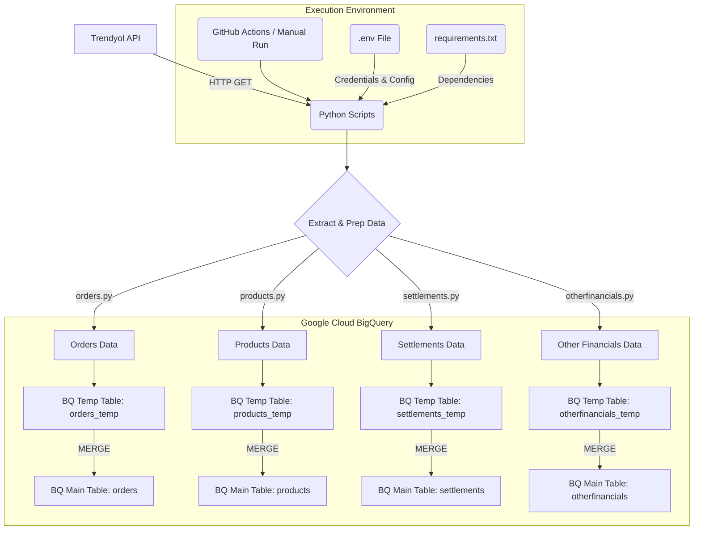

# Trendyol-ELT: Data Pipeline for Trendyol API to Google BigQuery

## Overview

Trendyol-ELT is a Python-based ELT (Extract, Load, Transform) pipeline that fetches data from various Trendyol API endpoints and loads it into Google BigQuery. This project helps in consolidating your Trendyol seller data into a data warehouse for analysis and reporting.

## Core Concept

The pipeline follows a standard ELT process:

1.  **Extract:** Data is extracted from the Trendyol API using Python scripts. It handles pagination, rate limiting, and date chunking for efficient data retrieval.
2.  **Load:** The raw extracted data (as JSON) is loaded into temporary tables in Google BigQuery.
3.  **Transform (Merge):** A `MERGE` operation is performed in BigQuery to upsert the data from temporary tables into final, structured tables. The raw JSON string is parsed into a JSON data type in BigQuery during this step.

## Key Features

*   **Multiple Data Domains:** Fetches data for Orders, Products, Settlements, and Other Financials.
*   **Asynchronous Fetching:** Utilizes `aiohttp` for concurrent API calls, significantly speeding up the data extraction process.
*   **Rate Limiting:** Respects API rate limits to prevent service disruption.
*   **Date Chunking:** Fetches data in manageable time windows for reliability.
*   **BigQuery Integration:** Seamlessly loads data into Google BigQuery, creating temporary tables and then merging into main tables.
*   **Environment-Based Configuration:** API keys, GCP credentials, and BigQuery settings are managed via an `.env` file.
*   **Automated Execution:** Includes a GitHub Actions workflow for scheduled and event-driven pipeline runs.
*   **Resilient Loading:** Uses a temporary table and merge strategy for robust data loading into BigQuery.

## Data Flow



## Repository Structure

```
Trendyol-ELT/
├── .github/workflows/        # GitHub Actions CI/CD pipeline
│   └── python-etl.yml
├── orders.py                 # Script to fetch order data
├── products.py               # Script to fetch product data
├── settlements.py            # Script to fetch settlement data
├── otherfinancials.py        # Script to fetch other financial data
├── requirements.txt          # Python dependencies
├── .env.example              # Example environment file (rename to .env)
└── README.md                 # This file
```

## Setup and Configuration

1.  **Clone the repository:**
    ```bash
    git clone https://github.com/your-username/Trendyol-ELT.git
    cd Trendyol-ELT
    ```

2.  **Create a Python virtual environment (recommended):**
    ```bash
    python -m venv venv
    source venv/bin/activate  # On Windows use `venv\Scripts\activate`
    ```

3.  **Install dependencies:**
    ```bash
    pip install -r requirements.txt
    ```

4.  **Set up Environment Variables:**
    *   Copy the `.env.example` file to a new file named `.env`.
        ```bash
        cp .env.example .env
        ```
    *   Edit the `.env` file and provide your specific credentials and configuration:
        ```ini
        # Trendyol API Credentials
        TRENDYOL_API_TOKEN=YOUR_API_TOKEN
        TRENDYOL_SUPPLIER_ID=YOUR_SUPPLIER_ID

        # Google Cloud BigQuery
        GOOGLE_APPLICATION_CREDENTIALS=/path/to/your/gcp-service-account-key.json
        GCP_PROJECT_ID=your-gcp-project-id
        BIGQUERY_DATASET_ID=your_bigquery_dataset_id
        BIGQUERY_LOCATION=your_bigquery_dataset_location # e.g., EU, US

        # Optional: Define specific table names if different from defaults
        # BIGQUERY_ORDERS_TABLE_ID=orders
        # BIGQUERY_PRODUCTS_TABLE_ID=products
        # BIGQUERY_SETTLEMENTS_TABLE_ID=settlements
        # BIGQUERY_OTHERFINANCIALS_TABLE_ID=otherfinancials
        ```
    *   **Important:** Ensure the `GOOGLE_APPLICATION_CREDENTIALS` path points to your valid GCP service account JSON key file. This service account needs permissions to write to BigQuery in the specified project and dataset.

## Running the Scripts

You can run each ELT script individually:

```bash
python orders.py
python products.py
python settlements.py
python otherfinancials.py
```

The scripts will print progress information to the console.

### Automated Execution

The project includes a GitHub Actions workflow in `.github/workflows/python-etl.yml`. This workflow:
*   Runs automatically on a schedule (daily at 07:00 UTC).
*   Can be triggered manually from the GitHub Actions tab.
*   Runs on pushes to the `main` branch.

For the GitHub Actions workflow to function correctly, you must configure the following secrets in your GitHub repository settings (Settings > Secrets and variables > Actions):
*   `TRENDYOL_API_TOKEN`
*   `TRENDYOL_SUPPLIER_ID`
*   `GOOGLE_APPLICATION_CREDENTIALS`: The content of your GCP service account key JSON file.
*   `GCP_PROJECT_ID`
*   `BIGQUERY_LOCATION`
*   `BIGQUERY_DATASET_ID`

## BigQuery Output

Each script creates/updates a corresponding main table in your specified BigQuery dataset (e.g., `orders`, `products`).
The primary structure of these tables includes:
*   An `id` column (or a relevant unique identifier for the data type).
*   A `rawJSON` column of type `JSON`. This column stores the complete, raw JSON object received from the Trendyol API for each record. This allows for flexible querying and reprocessing of data directly within BigQuery without needing to re-fetch from the API.
*   Other specific columns relevant to the data type (e.g., `orderNumber` for orders, `transactionType` for settlements and otherfinancials).

You can query the `rawJSON` field using BigQuery's JSON functions. For example:
```sql
SELECT
    id,
    JSON_VALUE(rawJSON.customer.firstName) AS customer_first_name,
    JSON_VALUE(rawJSON.grossAmount) AS gross_amount
FROM
    `your-gcp-project-id.your_bigquery_dataset_id.orders`
WHERE
    JSON_VALUE(rawJSON.orderStatus) = 'Delivered';
```

## Contributing

Contributions, issues, and feature requests are welcome. Please feel free to fork the repository, make changes, and submit a pull request.
